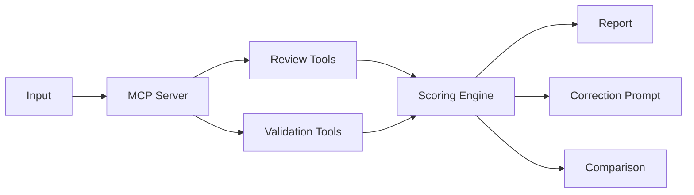

# ux_assistant

MCP server for UX reviews and context-aware design validation with scoring and actionable improvements.

[](https://github.com/loomandForge/ux-assistant/actions/workflows/ci.yml)
[](https://github.com/loomandForge/ux-assistant/actions/workflows/codeql.yml)
[](https://github.com/loomandForge/ux-assistant/actions/workflows/pages.yml)

- Website: `https://loomandforge.github.io/ux-assistant/`
- Live deployment (Vercel): `https://ux-assistant-kmpsrj7gu-gigithks-projects.vercel.app/`
- Security policy: [SECURITY.md](SECURITY.md)
- Contribution guide: [CONTRIBUTING.md](CONTRIBUTING.md)
- Changelog: [CHANGELOG.md](CHANGELOG.md)

# UX Review MCP

MCP server for UX review and context-aware design validation.

## What It Provides

The server supports two complementary modes:

1. Review mode (UX critique, challenge, improvement, and pitch narratives)
2. Validation mode (context-pack compliance, correction prompts, and run comparison)

### Electrical Experience Lab

The Electrical Experience Lab is an isolated experiment alongside the MCP review flow. It includes
a browser-based PDF report demo and the original deterministic Scenario 001 example. The report
demo extracts native PowerManager PDF text, keeps device and measurement-point names unchanged,
and turns supported readings into evidence-backed investigation recommendations.

- Engine: [`src/electrical-experience-lab/`](src/electrical-experience-lab/)
- Report demo and read-only prototype: [`docs/electrical-experience-lab/`](docs/electrical-experience-lab/)
- Supported report interpreters: Absolute Energy, Total Energy, Power Peak, and Load Variance
- Regenerate Scenario 001 data and vendored PDF parser: `pnpm prototype:electrical`

Uploaded PDFs are processed locally in the browser. The report demo does not upload files, rename
devices, diagnose root cause, or control equipment. It inspects at most 12 pages per report and
states when a larger report was only partially read. Scenario 001 measurements remain synthetic
fixture data for interface evaluation, not an electrical diagnosis or evidence of model performance.

## Visual Architecture



Pipeline summary:

- Inputs: Figma links, webpages, screenshots, image files, or HTML snippets
- MCP server: normalizes input, runs review or context validation workflows
- Scoring engine: combines rule findings and severity to produce compliance outcomes
- Outputs: reports, remediation prompts, and measurable run-to-run improvement deltas

### Review Tools

- `review_figma`, `review_input`
  - Run the full review pipeline from Figma, webpage, image, or HTML input.
  - Returns report content and a `runId` for follow-up.
  - Automatically saves the generated markdown report to `docs/superpowers/specs/` by default.
  - Includes `reportMarkdownPath` in run metadata when file save succeeds.
- `challenge_design`
  - Stress-test assumptions, edge cases, and UX risks.
- `challenge_from_input`
  - One-call flow: runs input review and challenge narrative in a single request.
- `improve_design`
  - Convert findings into prioritized, actionable improvements.
- `improve_from_input`
  - One-call flow: runs input review and improvement narrative in a single request.
- `pitch_design`
  - Reframe findings for stakeholder communication.
- Aliases:
  - `reviewfigma`, `challengedesign`, `improvedesign`, `pitchdesign`

### Context and Validation Tools

- `create_project`
  - Create a project container for rules, packs, and validation runs.
- `add_context_rule`
  - Add a context rule (defaults to draft).
- `list_context_rules`
  - List rules by project, with optional status filter.
- `approve_context_rule`
  - Mark a rule approved for pack enforcement.
- `create_context_pack`
  - Create a pack from selected rules (or all approved rules in the project).
- `validate_output_against_context`
  - Validate output against a context pack and return rule-level findings + overall compliance.
- `generate_correction_prompt`
  - Generate target-tool correction guidance from fail/partial findings.
- `compare_validation_runs`
  - Compare two validation runs for compliance delta and rule-level improvement/regression counts.

## Default Markdown Export

Every `review_input` and `review_figma` run now writes a markdown report file by default.

- Default output directory: `docs/superpowers/specs/` (relative to process working directory)
- File name pattern: `YYYY-MM-DD-ux-review-run-<runId>-<source-slug>.md`

Environment overrides:

- `UX_REVIEW_REPORT_DIR=/absolute/or/relative/path`
  - Overrides the markdown output directory.
- `UX_REVIEW_AUTO_SAVE_MARKDOWN=false`
  - Disables automatic markdown file generation.

## Sample Outputs (30-Second Tour)

### 1) UX Review Report

```json
{
  "runId": "run_01J4Q0F8A5KX8K3VQWX9",
  "summary": "Primary CTA hierarchy is clear, but form error states are too subtle on low-contrast backgrounds.",
  "topFindings": [
    {
      "severity": "high",
      "issue": "Competing primary actions in onboarding step 2",
      "suggestion": "Keep one primary CTA and demote alternatives to secondary buttons"
    },
    {
      "severity": "medium",
      "issue": "Supportive copy exceeds scannable length",
      "suggestion": "Reduce intro paragraph to 1 sentence and move details under progressive disclosure"
    }
  ],
  "score": 78
}
```

### 2) Context Validation Result

```json
{
  "validationRunId": "val_01J4Q0Z7B0QJ8A2MJ8N1",
  "project": "growth-checkout",
  "pack": "checkout-v1-approved",
  "overallCompliance": "partial",
  "complianceScore": 0.71,
  "rules": {
    "passed": 8,
    "failed": 2,
    "partial": 3,
    "unknown": 1
  },
  "highSeverityFailures": [
    "All color values must reference design tokens",
    "Only one primary CTA per step"
  ]
}
```

### 3) Correction Prompt from Failed Rules

```text
You are updating the latest checkout mock based on mandatory UX constraints.

Requirements to fix now:
1. Replace hard-coded color literals with design token references only.
2. Keep exactly one primary CTA in each step; demote others to secondary.
3. Increase error text contrast to meet accessible readability.

Do not change layout intent or information architecture.
Return the updated markup plus a short changelog mapping each change to a failed rule.
```

## Why This Matters for UX Teams

UX teams increasingly work across fragmented tools, AI agents, and product-specific design rules. This project explores how an MCP server can act as a context bridge, allowing AI tools to review and validate design outputs against approved UX principles, design-system rules, and project constraints.

It helps teams move from subjective feedback to repeatable quality checks that can be measured, compared, and improved over time.

## Validation Engine Architecture

Validation logic is modularized:

- `src/validation-engine.ts`
  - Orchestrates scoring, validator dispatch, and correction prompt assembly.
- `src/validators/code-like-validator.ts`
  - Deterministic checks for HTML/React-like source evidence.
- `src/validators/visual-validator.ts`
  - Web/screenshot/image placeholder guidance where deterministic validation is not yet implemented.
- `src/validators/types.ts`
  - Shared validator input and severity mapping.

This keeps server handlers focused on MCP I/O while allowing validators to evolve independently.

## Database Schema Versioning and Migration Notes

The server uses SQLite with startup-time schema initialization and additive migrations.

- Storage entry point: `src/storage.ts`
- Database path default: `~/.ux-review/reviews.db`
- Migration model: additive `CREATE TABLE IF NOT EXISTS` and safe column backfills via `ensureColumn(...)`

Current analysis-context tables introduced for the UX analysis flow:

- `analysis_metadata`
- `knowledge_items`
- `knowledge_relationships`
- `memory_entries`

Versioning guidance:

- Prefer additive schema changes first (new table/column) to remain backward-compatible.
- Avoid destructive migrations in runtime startup paths.
- If a future change requires destructive migration, add an explicit offline migration script and backup guidance.
- Keep table/column evolution notes in `CHANGELOG.md` under `Unreleased` until tagged.

## Custom Design System Support

Yes, users can bring their own design system today in two ways:

1. Review path
   - Use `designSystem=custom` with `customGuidelinePath` in `review_input` or `review_figma`.
2. Validation path
   - Define approved project rules via `add_context_rule` and enforce via context packs.

Current limitations:

- No one-click full design-system ingestion/sync from Figma variables/components.
- Current support is rule-driven and guideline-file-driven rather than fully automated DS sync.

## Current Deterministic Checks

Implemented now:

- CTA hierarchy detection in HTML/React-like source, including evidence for competing primary actions
- Hardcoded color literal detection (`#hex`, `rgb(a)`, and `hsl(a)`) for token/design-system style rules
- Heading hierarchy checks for missing headings, multiple/missing `h1`, and skipped heading levels
- Semantic landmark checks for basic page structure evidence (`main`, navigation, and headings)
- Form error-state checks for labels plus `aria-invalid`, `aria-describedby`, alert, error, or invalid hooks

These checks are deterministic and best suited for HTML/React-like outputs where the source can be
inspected directly. Findings include concrete evidence, recommendation text, and correction prompts
that can be passed back into Codex, Cursor, Figma Make, or similar AI-assisted build tools.

Currently returns guided `unknown` (planned deeper implementation):

- direct web URL inspection
- pixel-level screenshot/image visual validation

## Roadmap

- Figma variable and component ingestion into project-aware context rules
- Visual screenshot validation with deterministic UI evidence extraction
- Accessibility heuristics (contrast, focus order, semantic structure)
- Design-token compliance checks across generated and hand-authored UI
- Remote xmcp execution wired to the same review pipeline as the local MCP server
- Codex, GitHub CLI, model-provider, and Figma MCP readiness checks for AI-assisted report workflows
- Hosted team workspace on Vercel + Supabase for auth, projects, rules, runs, and audit history
- UX debt tracking and trend analysis per feature area
- Team dashboards for validation quality and regression signals
- Slack, Jira, and Figma integrations for workflow-level automation
- Portfolio-level UX governance metrics across products and squads

## Current Product Boundary

The local stdio MCP server is the strongest path today. It runs review and validation workflows,
stores local SQLite-backed runs, and can generate markdown reports. Remote xmcp deployment is
available for discovery/build validation, but the full remote execution path is still being
completed. Hosted team workspaces, billing, and deeper visual validation are roadmap items.

## Requirements

- Node.js v20 (via [nvm](https://github.com/nvm-sh/nvm))
- pnpm v10.34.1
- Uses `better-sqlite3` native addon, so real Node.js is required (Bun is not supported)

## Team Setup (One-Time)

### Quick Start (Recommended)

```bash
git clone <your-repository-url> ux-assistant
cd ux-assistant
nvm install 20
nvm use
pnpm i --frozen-lockfile
pnpm run build
./setup.sh
pnpm run doctor
```

Then restart your MCP client app (fully quit, reopen, start a new chat).

### Update Existing Clone

```bash
cd ux-assistant
git pull origin main
pnpm i --frozen-lockfile
pnpm run build
```

If you used `setup.sh`, auto-update hooks are already enabled in this clone.

### Manual Setup

If `./setup.sh` does not work:

1. Install and use Node 20

```bash
nvm install 20
nvm use
```

2. Clone and build

```bash
git clone <your-repository-url> ux-assistant
cd ux-assistant
pnpm i --frozen-lockfile
pnpm run build
```

3. Add MCP config for your MCP client (OpenCode or similar)

```bash
mkdir -p ~/.config/agent ~/.config/opencode
```

Add to `~/.config/agent/opencode.json` (and/or `~/.config/opencode/opencode.json`):

```json
{
  "mcp": {
    "ux-review": {
      "type": "local",
      "command": [
        "/ABSOLUTE/PATH/TO/ux_assistant_mcp/bin/ux-review-mcp"
      ],
      "enabled": true
    }
  }
}
```

Replace `/ABSOLUTE/PATH/TO/` with your actual path.
The command must end with `/bin/ux-review-mcp`.

4. Restart your MCP client

Fully quit and reopen. Start a new chat session.

### Alternative: VS Code MCP Setup

Add to VS Code settings under `claude.mcpServers`:

```json
{
  "claude.mcpServers": {
    "ux-review": {
      "command": "/ABSOLUTE/PATH/TO/ux-assistant/bin/ux-review-mcp"
    }
  }
}
```

Then reload VS Code window.

## Why the Launcher Script?

Some MCP clients can inject a Bun-based `node` shim into PATH. Since `better-sqlite3` is native, it must run on real Node with the right ABI. The `bin/ux-review-mcp` launcher:

1. Reads `.nvmrc` for required Node major version
2. Resolves the matching nvm Node binary
3. Falls back to system Node locations if needed
4. Skips Bun shims automatically

## Usage Flow

### Review Flow

1. Run `review_figma` or `review_input`
2. Capture `runId`
3. Run one or more of:
   - `challenge_design`
   - `improve_design`
   - `pitch_design`

### Context-Validation Flow

1. Run `create_project`
2. Add rules via `add_context_rule`
3. Approve rules via `approve_context_rule`
4. Create a pack via `create_context_pack`
5. Validate output via `validate_output_against_context`
6. Generate remediation via `generate_correction_prompt`
7. Re-run and compare with `compare_validation_runs`

### Agent-Assisted Report Readiness

Run the setup doctor when you want to confirm the local environment can support AI-assisted
UX review reporting:

```bash
pnpm run doctor
```

The doctor checks:

- Node.js major version and pnpm availability
- Git origin configuration
- GitHub CLI installation and authentication
- Codex environment or CLI presence
- GHCP/GitHub/GLM model token or GitHub Copilot credential presence
- Optional Figma MCP URL configuration

## Verification

```bash
# MCP visibility
opencode mcp list | grep ux-review

# Initialize smoke test
echo '{"jsonrpc":"2.0","id":1,"method":"initialize","params":{"protocolVersion":"2024-11-05","capabilities":{},"clientInfo":{"name":"test","version":"1"}}}' | ./bin/ux-review-mcp

# Full local tests
pnpm test
```

## Troubleshooting

| Symptom | Cause | Fix |
|---|---|---|
| `Cannot find module better_sqlite3.node` | Bun shim was used | Run via `bin/ux-review-mcp` |
| NODE_MODULE_VERSION mismatch | Node version differs from install version | `nvm use && pnpm rebuild better-sqlite3` |
| `Could not locate the bindings file` after pnpm dependency setup | pnpm blocked native build scripts | `pnpm i --frozen-lockfile && pnpm rebuild better-sqlite3` |
| Tools not visible | stale client session | restart client and open new chat |
| `ux-review` disconnected | Node 20 not found | `nvm install 20 && nvm use` |

## CI Email Notifications

The GitLab pipeline includes `notify_email` for successful pushes on `main`.

Configure CI/CD variables:

- `SMTP_HOST`
- `SMTP_PORT` (optional, default `587`)
- `SMTP_USER`
- `SMTP_PASS`
- `EMAIL_FROM`
- `EMAIL_TO` (comma-separated)

If required values are missing, notification is skipped without failing the pipeline.

## Automatic Local Updates (Opt-In per Clone)

Git cannot force-update all existing local clones. Each clone must opt in.

This repo includes:

- `.githooks/post-merge`
- `scripts/auto-update.sh`
- `scripts/enable-auto-update.sh`

Enable in clone:

```bash
pnpm run auto-update:enable
```

Run once manually:

```bash
pnpm run auto-update:pull
```

Safety behavior:

- updates only on `main`
- skips when local changes exist
- fast-forward only
- skips if local branch has unique commits
